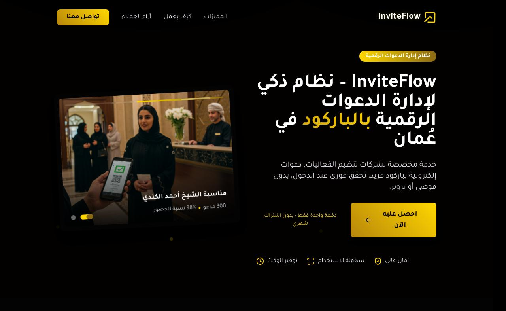

## 📄 About the Project

**InviteFlow** is a smart digital invitation management system built for event organizers in Oman. It helps you create barcoded digital invitations, verify guests instantly at event entrances using mobile + PDA, and track attendance in real time. No subscriptions. One-time setup. Full support.

## 📷 Project Screenshot

---

## 🌐 Live Demo

**Try it here**: [https://inviteflow.netlify.app/](https://inviteflow.netlify.app/)  
*(Replace this link with your actual deployed app URL.)*

---

## ✨ Key Features

- 🎫 Digital invitations with unique barcodes  
- 📲 Instant verification via mobile + PDA integration  
- 📊 Real-time reports on attendance and check-in stats  
- 🖼️ Custom branding for each event  
- 🌐 Arabic-first UI with English support  
- 🔒 Secure, fast, and easy to use  
- 💼 One-time setup – no recurring payments  

Whether you're running a wedding, corporate conference, government ceremony, or private event — InviteFlow keeps the door organized and the data accurate.

---

## 🧰 Tech Stack

- ⚡ [Vite](https://vitejs.dev/) — ultra-fast build tool  
- ⚛️ [React](https://reactjs.org/) — frontend framework  
- 🧑‍💻 [TypeScript](https://www.typescriptlang.org/) — type-safe JS  
- 🎨 [Tailwind CSS](https://tailwindcss.com/) — utility-first styling  
- 🧩 [shadcn/ui](https://ui.shadcn.dev/) — clean and accessible components  

---
